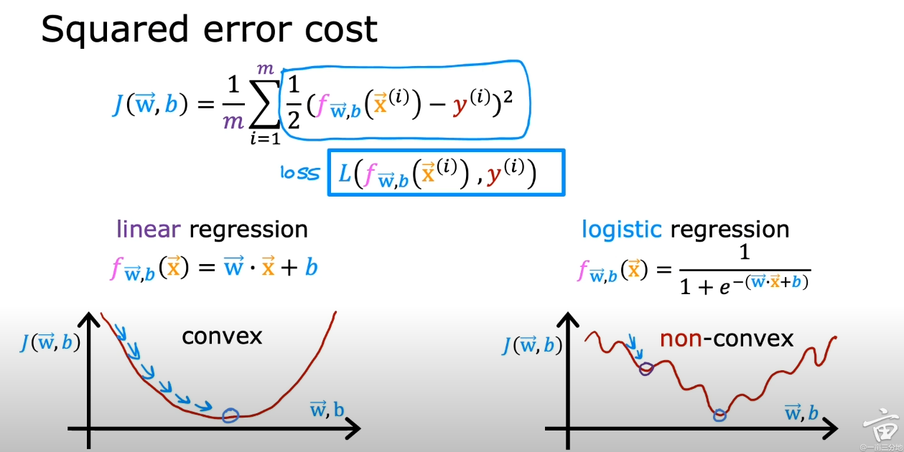
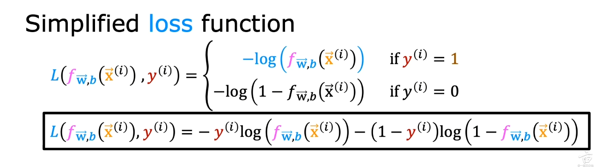

1. 用MSE做loss的Logistic Rregression是convex problem吗
    No, not convex,

2.解释并写出MSE的公式, 什么时候用到MSE?
    - Mean Square Error $\frac{1}{N}\sum_{i=1}^N(Y_i - \hat{Y}_i)^2$
    - average of the squares of the error
    - Regression, normally distributed errors, Emphasizing larger errors(more weight to larger error, due to square)

3. Linear Regression最小二乘法和MSE关系
    - MSE is the objective function of Least Squares Method for linear regression
    - Least Square Method finds the coefficients (global min) that minimize the sum of squared residuals which is equivalent to minimizing the MSE.

4. 什么是relative entropy, What is KL divergence
    - Relative entropy, also known as Kullback-Leibler divergence or cross entropy, is a measure that quantifies the difference between two probability distributions.
    - $D_{KL}(P||Q) = \sum_{x\in\mathcal{X}}P(x) \log \left( \frac{P(x)}{Q(x)}\right)$
    - Expectation with respect to the distribution $p$ of the logarithmic difference between the probabilities P and Q
    - Cross Entropy $H(P, Q) = -\sum_{x\in\mathcal{X}}P(x) \log Q(x) = H(p) +D_{KL}(P||Q)$, expected value of logq with respect to the distribution p

5. Logistic Regression的loss是什么
  

6. Logistic Regression的 Loss 推导
    use Maximum Likelihood Estimation
7. SVM的loss是什么
    - goal is to find a hyperplane that separates the data points of different classes with a maximum margin.
    - hinge loss formulation and the squared hinge loss formulation.

8. Multiclass Logistic Regression, 为什么用cross entropy做cost function
    - softmax regression/Multinomial logistic regression
    - extension of binary logistic regression to handle problems of multiple classes
    - The softmax function takes the linear combination of the feature values and weights for each class and applies the exponential function to them. It then normalizes the exponentiated values by dividing them by the sum of all exponentiated values. This normalization ensures that the resulting probabilities sum up to 1.
    - Multiclass logistic regression uses a specific loss function called the cross-entropy loss or log loss to measure the discrepancy between the predicted class probabilities and the true class labels. The goal is to minimize this loss by adjusting the model parameters.
    - log-likelihood (provides MLE)
9. Decision Tree split node的时候优化目标是啥
    - To find the best split that maximize the separation between different classes or reduces the impurity with each resulting node.
    - different decision tree algorithm has different specific objectives
        - Gini impurity
        - Entropy
        - Information Gain
10. Log-loss是什么，什么时候用logloss
    - Log loss, also known as logarithmic loss or logistic loss, is a loss function commonly used in binary and multiclass classification problems. It measures the performance of a classification model by quantifying the discrepancy between predicted probabilities and the true class labels.
    - based on the principles of maximum likelihood estimation and information theory.
    - The formula for log loss in binary classification is: Log Loss = -[y * log(p) + (1 - y) * log(1 - p)]
    - Classification problem usually uses log loss
Logistic Regression
1. logistic regression和svm的差别 （我想这个主要是想问两者的loss的不同以及输出的不同，一个是概率输出一个是score）
    - Objective:
        - logistic regression: model the probability of an instance belonging to a certain class using a logistic/sigmoid function. It estimates the probabilities and makes predictions based on a threshold
        - SVM: the objective of SVM is to find a hyperplane that maximally separates the instance of different classes. SVM focuses on maximizing the margin between the classes, rather than directly estimating class probabilities.
    - Decision boundary
        - logistic regression: linear decision bounday, dividing the feature space into two regions for binary classificaiton
        - SVM: also uses linear decision bounday, but it can employ non-linear decision boundaries through kernel
    - Loss function:
        - logistic regression: log loss: quantifies the discrepancy between predicted probabilities and true class labels.
        - SVM: hinge loss penalizes misclassifications and encourages maximizing the margin
    - Optimization method:
        - logistic regression: gradient descent, newton’s method, or other iterative method
        - SVM: convex optimization techniques such as quadratic programming or sequential minimal optimization
    - Robust
        - logistic regression is sensitive to outliers
        - SVM is more robust to outliers due to the margin maximization objective.
Decision Tree
1. How regression/classification DT split nodes
    - Regression: find the split that minimizes the variance or the sum of squared differences between the predicted and actual values within each resulting node.
    - Classification: find the split that maximizes the separation or purity between different classes within each resulting node
2. How to prevent overfitting in DT? How to do regularization in DT?
    - pruning
    - Set minimum Sample Requirements for splittting nodes during tree construction
    - Feature selection
    - Ensemble methods
    - cross-validation
    - maximum depth
    - minimum impurity decrease
Clustering and EM
1. K-means clustering (explain the algorithm in detail; whether it will converge, 收敛到global or local optimums; how to stop
    K-means clustering is an unsupervised machine learning algorithm used for partitioning a dataset into k distinct clusters based on similarity measures. It aims to minimize the within-cluster sum of squares (WCSS) or the average squared distance between data points and their assigned cluster centroids. Here's an explanation of the k-means clustering process:
    - Initialization:
    The algorithm starts by randomly selecting k initial cluster centroids. These centroids can be randomly chosen from the data points or initialized using other strategies.
    - Assignment:
    Each data point is assigned to the nearest centroid based on a distance metric, commonly the Euclidean distance. This step creates initial clusters based on the closest centroids.
    - Update:
    The centroids are recalculated as the mean of all the data points assigned to each cluster. This step updates the centroid positions, adjusting them to be closer to the data points in their respective clusters.
    - Iteration:
    Steps 2 and 3 are repeated iteratively until convergence. In each iteration, data points are reassigned to the closest centroids, and centroids are updated based on the new assignments.
    Convergence: K-means clustering algorithm will eventually converge to a solution. The convergence occurs when the assignments and centroids no longer change significantly between iterations or when a predefined stopping criterion is met.
    Global vs. Local Optima: K-means clustering is **sensitive to the initial positions of the centroids**. It can converge to a local optimum rather than the global optimum, which means that the clustering result depends on the initial centroid locations. Multiple runs with different initializations are commonly performed to mitigate the risk of getting trapped in a poor local optimum.
    Stopping Criterion: Several stopping criteria can be used to stop the training iterations of k-means clustering. Common approaches include:
    - Convergence criterion: Stop when the centroids and assignments no longer change significantly.
    - Maximum number of iterations: Set a fixed number of iterations to limit computation time.
    - Threshold on WCSS improvement: Stop when the improvement in WCSS falls below a specified threshold.
    Selecting the Number of Clusters (k): Choosing the optimal number of clusters (k) is a critical step in k-means clustering. Some methods for determining the appropriate k value include:
    - Elbow method: Plot the WCSS as a function of k and choose the k value at the "elbow" point, where further increasing k does not significantly reduce WCSS.
    - Silhouette coefficient: Calculate the silhouette coefficient for different k values and select the one with the highest average coefficient, indicating better cluster quality.
    In summary, k-means clustering is an iterative algorithm that partitions a dataset into k clusters by minimizing the WCSS. It eventually converges, but it can be sensitive to initializations, leading to local optima. Stopping criteria are used to determine when to stop the iterations, and techniques such as the elbow method or silhouette coefficient aid in selecting an appropriate value for k.
2. EM算法是什么
    The EM (Expectation-Maximization) algorithm is an **iterative optimization algorithm used to estimate the parameters of statistical models with latent or unobserved variables**. It is particularly useful in situations where there are missing data, incomplete data, or when the data is **generated from a mixture of probability distributions**. The EM algorithm alternates between an expectation step (E-step) and a maximization step (M-step) to update the parameter estimates. Here's an overview of how the EM algorithm works:
    - Initialization:
    Initialize the parameters of the model with some initial values.
    - Expectation Step (E-step):
    In the E-step, the algorithm computes the expected values of the latent variables or missing data given the current parameter estimates. It calculates the posterior probabilities or membership probabilities of each latent variable.
    - Maximization Step (M-step):
    In the M-step, the algorithm updates the parameter estimates by maximizing the expected log-likelihood calculated in the E-step. It treats the expected values of the latent variables as complete data and performs a standard maximum likelihood estimation or other optimization methods to find the parameter values that maximize the log-likelihood.
    - Iteration:
    Steps 2 and 3 are repeated iteratively until convergence, where the parameter estimates no longer change significantly or a stopping criterion is met. The convergence can be determined by monitoring the change in the log-likelihood or other convergence criteria.
    - Final Parameter Estimates:
    After convergence, the final parameter estimates are obtained, representing the maximum likelihood estimates or maximum a posteriori estimates given the observed and latent variables.
    The EM algorithm is widely used in various statistical modeling and machine learning applications, including clustering, mixture models, hidden Markov models, and more. It provides a framework for estimating parameters when dealing with incomplete or missing data. The E-step computes the expectation of the latent variables given the current parameters, and the M-step maximizes the log-likelihood using these expected values to update the parameter estimates.
    It's important to note that the EM algorithm finds a **local optimum** and **may not guarantee convergence to the global optimum**. Multiple runs with different initializations are often performed to mitigate the risk of being trapped in a poor local optimum.
3. GMM是什么，和Kmeans的关系
    GMM stands for Gaussian Mixture Model, which is a probabilistic model used for **representing and analyzing data that can be modeled as a combination of multiple Gaussian distributions**. It is a powerful technique for **density estimation**, **clustering**, and **generating synthetic data**. The GMM **assumes that the observed data points are generated from a mixture of Gaussian** distributions, each representing a different underlying component or cluster. Here's an explanation of the GMM model:
    - Model Representation:
    The GMM represents the data as a weighted sum of K Gaussian distributions. Each Gaussian distribution corresponds to a component or cluster within the data. The GMM model is defined by the following parameters:
        - Component weights (π): The proportions or probabilities of each component in the mixture.
        - Mean vectors (μ): The mean values of the Gaussian distributions.
        - Covariance matrices (Σ): The variance and covariance of the Gaussian distributions.
    - Probability Density Function:
    The GMM calculates the probability density function (PDF) of a data point x as the weighted sum of the PDFs of the individual Gaussian components:
    PDF(x) = ∑(π_k * N(x | μ_k, Σ_k))
        Here, N(x | μ_k, Σ_k) represents the Gaussian distribution with mean μ_k and covariance Σ_k, and π_k is the weight or proportion of the k-th component.
    - Parameter Estimation:
    The parameters of the GMM, including the component weights, mean vectors, and covariance matrices, are estimated from the observed data using the Expectation-Maximization (EM) algorithm. The EM algorithm iteratively updates the parameter estimates by alternating between an E-step and an M-step, as explained in the previous response about the EM algorithm.
    - Applications:
    GMMs have various applications, including:
        - Density Estimation: GMMs can estimate the underlying probability density function of the data, enabling the generation of synthetic data samples.
        - Clustering: GMMs can perform soft clustering, where each data point is assigned a probability of belonging to each cluster, allowing for fuzzy boundaries between clusters.
        - Anomaly Detection: GMMs can detect anomalies by modeling the normal behavior of the data and identifying instances with low likelihoods under the model.
    The GMM model provides a flexible framework for capturing complex data distributions by combining multiple Gaussian components. It is a versatile tool for density estimation, clustering, and other statistical modeling tasks, offering probabilistic interpretations and handling data with varying cluster sizes and shapes.
    GMM vs K-means: GMM and K-means have different assumptions, objectives, and cluster representations. GMM provides probabilistic soft assignment and accommodates clusters with various shapes and orientations. K-means, on the other hand, performs hard assignment and assumes spherical clusters with equal variance. The choice between GMM and K-means depends on the nature of the data and the desired characteristics of the clusters being sought.